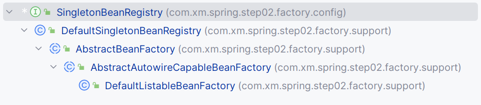
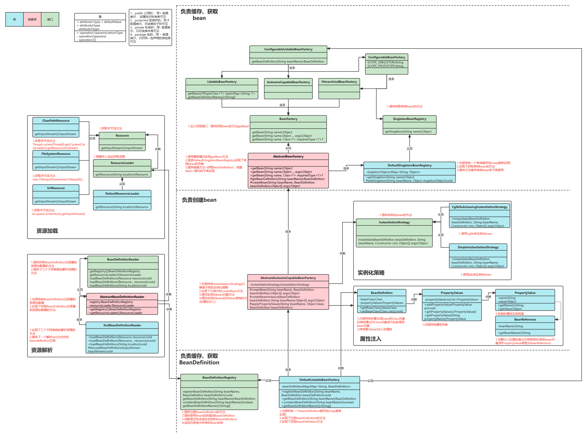

### :smiling_face_with_three_hearts:  Spring源码学习，了解主要实现原理，不涉及复杂的功能

> 学习源码是一讲让我苦恼的事情，一开始我去看spring源码，发现单纯的去看源码你会很难理解和学会他，主要有如下原因
- 里面模块相互调用十分复杂
- 需要扎实的java基本功
- 看别人的源码视频没有营养
- 没人做到可以带你实际从0编写源码

> 在经过一段时间的思考和摸索后，建议从从下方面入手
- Java基础知识有扎实的理解
- 源码的频繁使用的设计模式都掌握
- 源码使用的api都要熟悉
- 除了阅读理论知识，编写实际的代码并进行练习是更好的学习方式之一
- 加入开发者社区，参与讨论和互动
- 找一位Java开发者作为你的导师

#### step01
- 了解简单的spring容器的实现原理
- bean由简单的object替代 后续bean的定义应该是class属性和其他一些复杂的属性

#### step02

- Spring容器的bean的定义BeanDefinition现在由Class实现，暂无其他复杂的属性
- bean的定义改成了class，但是单例bean对象存放哪里呢，这里设计了SingletonBeanRegistry和单例容器实现类DefaultSingletonBeanRegistry，本质就是单例bean对象(注意是对象而不是属性)的注册和获取
- 接着要处理BeanDefinition了，他也要有个容器，并且也要注册和获取才可以实现复杂功能吧，于是设计了AbstractBeanFactory使用模板方法设计模式继承DefaultSingletonBeanRegistry，就有了单例bean对象的注册和获取功能了，这样就可以在对BeanDefinition进行注册和处理的时候顺便也注册到单例bean对象容器里面去
- AbstractBeanFactory是复杂的，其实他并没有直接作为BeanDefinition容器功能以及实现注册和获取的功能，而是交给了子类实现，因为BeanDefinition是复杂的，不像单例bean对象容器那样直接存储对象，而是对BeanDefinition的处理，这就可以动态实现很多功能了，因为BeanDefinition存储的是class和其他属性，子类想怎么做就怎么做
- AbstractBeanFactory实现了BeanFactory接口的getBean方法，因为是获取对象，自然由单例bean对象直接获取，如果获取不到就应该从BeanDefinition容器中去生成对象并注册到单例对象容器中并返回了，这个功能AbstractBeanFactory并没有自己实现，交给了子类实现，也是模板设计模式的体现，在这个类中执行2个没有实现的抽象方法，实际是执行实现他的子类的方法
- 原本以为AbstractBeanFactory的实现类AbstractAutowireCapableBeanFactory应该就是BeanDefinition容器的设计类了，结果发现不是，而是又抽象了一层，主要是将BeanDefinition实例化成对象并注册到单例对象容器中并返回，我认为这么实现的目的是不想让BeanDefinition容器层和单例bean对象容器的实现方法出现耦合，单独抽象一层处理
- DefaultListableBeanFactory就是真正的BeanDefinition容器注册和获取的方法了，也是容器本身

#### step03
- 上一步的对于BeanDefinition的反射生成对象太简单了，使用默认的无参构造生成，如果有参数怎么办，于是设计了InstantiationStrategy，这个类的作用就是解析构造函数，获取构造函数的参数，然后根据参数去获取参数的值，最后生成对象
- InstantiationStrategy接口有2种实现方式分别是cglib和反射
- 重点关注的是AbstractAutowireCapableBeanFactory类，也就是上一步的为了实现解耦增加的一层，这一层主要是将BeanDefinition实例化，并放入单例bean对象容器的，这里引入了一个属性InstantiationStrategy，由它来完成对象的实例化，实现了有参的实例化功能，也是在这一层，这也充分说明了解耦的好处，什么层该做什么事，单一职责分明

#### step04
- BeanDefinition开始增加属性了，本来只有class，现在增加了propertyValues，主要是完善实例化后没有给对象填充属性的问题
- 还是在之前解耦的那个类AbstractAutowireCapableBeanFactory里面实现的，这个类的主要功能就是通过BeanDefinition创建对象并且放入单例bean容器中，目前实现了有参，无参构造实例化，并且给实例化后的对象填充属性的功能

### step05

1. 这一步实现xml注册bean，首先要解析xml文件，就要先获取xml文件的字节流，然后根据属性获取对应的值，然后根据值去获取对应的类，然后将类注册到BeanDefinition容器中，然后将BeanDefinition容器注册到BeanFactory中，然后就可以通过BeanFactory获取对象了
2. 我们只需要关注图片的左边哦，创建Resource接口获取资源，提供统一获取字节流的方法getInputStream,并提供三个实现类分别以不同方式获取
    - ClassPathResource:Thread.currentThread().getContextClassLoader().getResourceAsStream
    - FileSystemResource:new FileInputStream(new File(path))
    - UrlResource:url.openConnection().getInputStream()
3. 创建ResourceLoader接口，这个接口提供了默认方法加载资源并返回Resource资源，对于提供获取资源方法getResource(String location),并且扩展了提供默认实现类根据不同路径生成不同类型Resource
4. 创建BeanDefinitionReader接口，提供获取BeanDefinition注册器和资源加载器的方法和三个不同参数的解析资源的方法，这里的解析资源方法是抽象的，由子类实现，因为不同的资源解析方式不同
5. 抽象类AbstractBeanDefinitionReader实现了BeanDefinitionReader接口，内部持有BeanDefinition注册器和ResourceLoader资源加载器(用于解析资源)，用于给子类统一提供注册器和加载器，同时提供了三个不同参数的解析资源的方法，这里的解析资源方法是抽象的，由子类实现，因为不同的资源解析方式不同
6. XmlBeanDefinitionReader继承抽象类AbstractBeanDefinitionReader,实现了接口中的解析资源方法，真正提供了解析Xml文件的能力，并且通过内部持有的注册器将bean定义注册到BeanDefinition缓存池中，以及注册单例bean对象到单例bean对象容器中
7. 这里多了几个类ConfigurableListableBeanFactory,AutowireCapableBeanFactory,HierarchicalBeanFactory等是后续用于配置功能的扩展，目前还没有实现，先不管